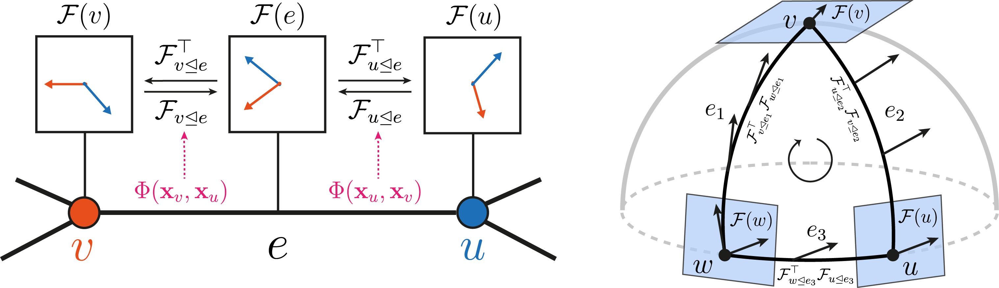

[](https://github.com/twitter-research/neural-sheaf-diffusion/actions) 
[](https://github.com/twitter-research/neural-sheaf-diffusion/blob/main/LICENSE)

# Neural Sheaf Diffusion

This repository contains the official code for the paper 
**[Neural Sheaf Diffusion: A Topological Perspective on Heterophily and Oversmoothing in GNNs](https://arxiv.org/abs/2202.04579) (NeurIPS 2022)**.



## Getting started

We used `CUDA 10.2` for this project. To set up the environment, run the following command:

```bash
conda env create --file=environment_gpu.yml
conda activate nsd
```
For using another `CUDA` version, modify the version specified inside `environment_gpu.yml`. If you like to run 
the code in a CPU-only environment, then use `environment_cpu`. 

To make sure that everything is set up correctly, you can run all the tests using:
```bash
pytest -v .
```

## Running experiments

To run the experiments without a Weights & Biases (wandb) account, first disable `wandb` by running `wandb disabled`. 
Then, to run the training procedure on `texas`, simply run the example script provided:
```commandline
sh ./exp/scripts/run_texas.sh
```

To run the experiments using `wandb`, first create a [Weights & Biases account](https://wandb.ai/site). Then run the following
commands to log in and follow the displayed instructions:
```bash
wandb online
wandb login
```
Then, you can run the example training procedure on `texas` via:
```bash
export ENTITY=<WANDB_ACCOUNT_ID>
sh ./exp/scripts/run_texas.sh
```
 
### Hyperparameter Sweeps

To run a hyperparameter sweep, you will need a `wandb` account. Once you have an account, you can run an example
sweep as follows:
```bash
export ENTITY=<WANDB_ACCOUNT_ID>
wandb sweep --project sheaf config/orth_webkb_sweep.yml
```
This will set up the sweep for a discrete bundle model on the WebKB datasets 
as described in the yaml config at `config/orth_webkb_sweep.yml`.

To run the sweep on a single GPU, simply run the command displayed on screen after running the sweep command above. 
If you like to run the sweep on multiple GPUs, then run the following command by typing in the `SWEEP_ID` received above.
```bash
sh run_sweeps.sh <SWEEP_ID>
```
### Datasets

The WebKB (`texas`, `wisconsin`, `cornell`) and `film` datasets are downloaded on the fly. The
[WikipediaNetwork datasets](https://academic.oup.com/comnet/article/9/2/cnab014/6271062) with the Geom-GCN pre-processing 
can be downloaded from the [Geom-GCN repo](https://github.com/graphdml-uiuc-jlu/geom-gcn/tree/f1fc0d14b3b019c562737240d06ec83b07d16a8f/new_data).
The files for the Planetoid datasets can also be found in the [Geom-GCN repo](https://github.com/graphdml-uiuc-jlu/geom-gcn/tree/master/data). 
The downloaded files must be placed into `datasets/<DATASET_NAME>/raw/`.

## Credits

For attribution in academic contexts, please use the bibtex entry below:
```
@inproceedings{
 bodnar2022neural,
 title={Neural Sheaf Diffusion: A Topological Perspective on Heterophily and Oversmoothing in {GNN}s},
 author={Cristian Bodnar and Francesco Di Giovanni and Benjamin Paul Chamberlain and Pietro Li{\`o} and Michael M. Bronstein},
 booktitle={Advances in Neural Information Processing Systems},
 editor={Alice H. Oh and Alekh Agarwal and Danielle Belgrave and Kyunghyun Cho},
 year={2022},
 url={https://openreview.net/forum?id=vbPsD-BhOZ}
}
```
